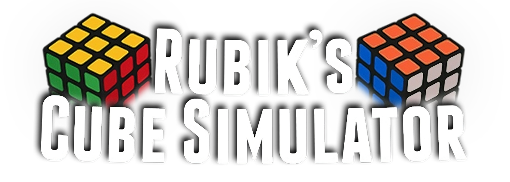

# RubikSimulator

**RubikSimulator** is a digital game of the renowned brain teaser, designed to offer a realistic and engaging experience directly on your pc.

Whether you are a beginner or an expert, our simulator allows you to:
* Solve the cube interactively
* Explore standard rotations with smooth animations
* Visualize the cube state in 3D
* Train with built-in timer and visualize other stats

## Used Technologies

The project has been developed using a set of modern technologies, with the aim of offering a smooth and accessible simulation of the famous Rubik's Cube

* Programming Language:
We've used 100% Python for the cube logic, the move management and user interface integration

* Graphic Rendering:
For our game we utilize Pygame and OpenGl for the 3D rendering

* To run the game:
Execute the RubikSimulator.exe and enjoy the game!

## Credits

Developed as a school project by two aspiring programmers.